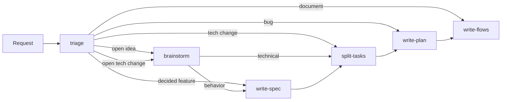

# Personal Agent Skills

Agent skills that take a request from idea to shipped code and docs. Works with [`npx skills`](https://github.com/vercel-labs/skills).

## Install

```bash
npx skills add arcadesunlabs/skills --skill '*' -a claude-code -y
```

Use your agent after `-a` (`cursor`, `codex`, ...). Add `-g` for a global install.

No config file. Paths and workflow live in each `SKILL.md`; edit the installed skill to change them.

## How it works



| Skill         | Writes                              |
| ------------- | ----------------------------------- |
| `triage`      | nothing; picks path and mode        |
| `brainstorm`  | nothing; closes decisions           |
| `write-spec`  | `<use-case>.spec.md`, rules, actors |
| `split-tasks` | `tasks.md` when split               |
| `write-plan`  | `plan.md`, code, `changelog.md`     |
| `write-flows` | `<use-case>.flows.md`               |

## Modes

Name one in your request. Default: `guided` for features, `review` for bugs and technical changes.

- `guided`: the agent asks, you answer. You approve the breakdown and the plan.
- `review`: the agent decides, then you accept each decision. You approve the plan.
- `autonomous`: the agent decides and ships. Only your agent's permissions apply.

## Docs layout

```text
.docs/
├── index.md
├── architecture/architecture.md
├── actors/<actor>.md
├── <domain>/
│   ├── <domain>.rules.md
│   └── <use-case>/
│       ├── <use-case>.spec.md     # what it does
│       ├── <use-case>.flows.md    # how the code does it
│       └── changelog.md           # when it changed
├── capabilities/<capability>/
└── codebase/<initiative>/
```

Tags are defined in [write-spec — Scope](./skills/write-spec/SKILL.md#scope). `plan.md` and `tasks.md` are deleted when work is done.

## Triage hook (Claude Code)

Optional. Nudges the agent to run `triage` once per session. Add to `.claude/settings.json`:

```json
{
  "hooks": {
    "UserPromptSubmit": [
      {
        "hooks": [
          {
            "type": "command",
            "command": "node \"$CLAUDE_PROJECT_DIR/.claude/skills/triage/scripts/prompt-hook.mjs\""
          }
        ]
      }
    ]
  }
}
```

Global install: `~/.claude/skills/triage/scripts/prompt-hook.mjs`.

## Develop

```bash
npm run new -- my-skill
npm run validate
npx skills add . --skill my-skill -a claude-code -y
```

## Credits

Inspired by [obra/superpowers](https://github.com/obra/superpowers) and the "grill me" skill in [mattpocock/skills](https://github.com/mattpocock/skills).
