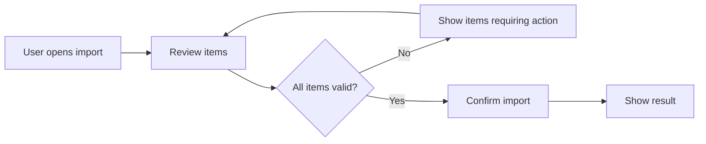
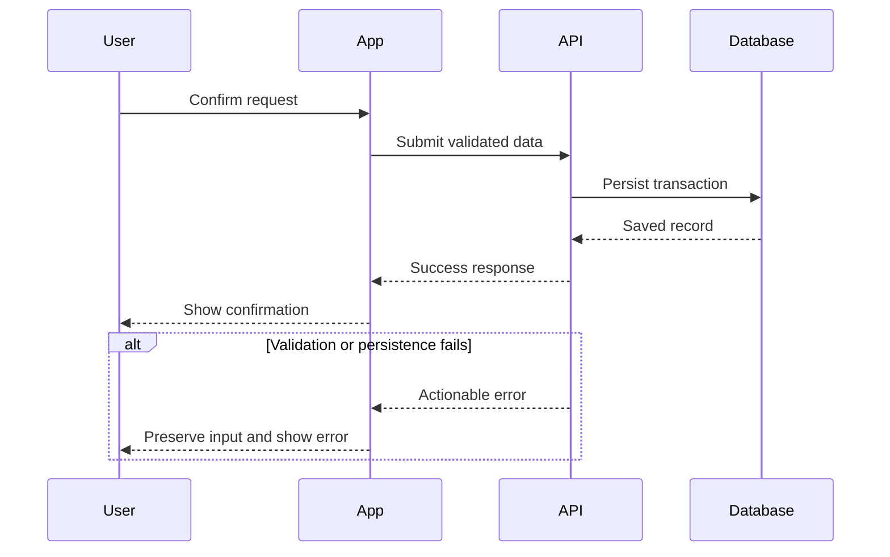
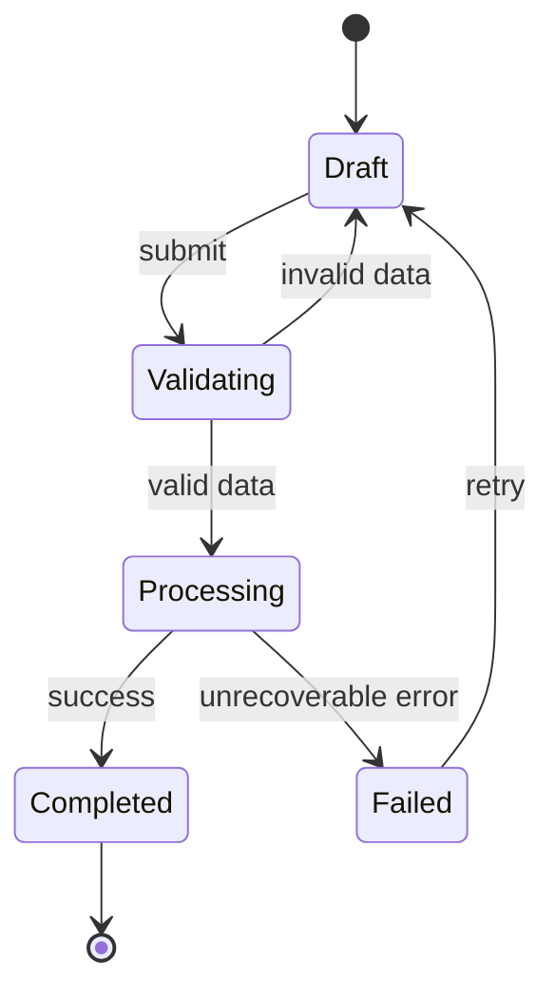
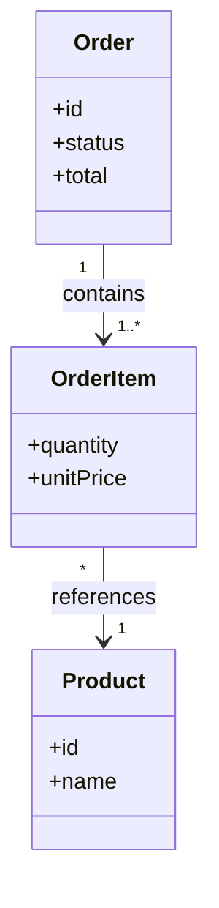
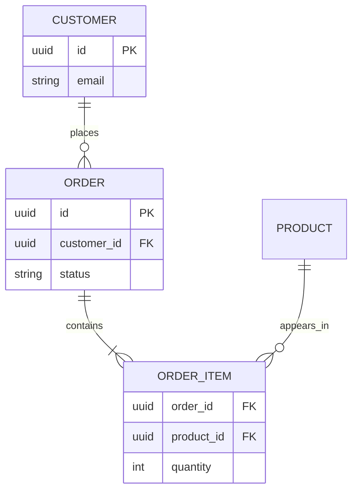
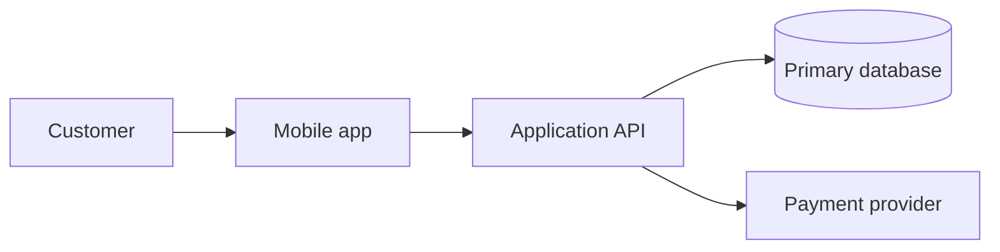
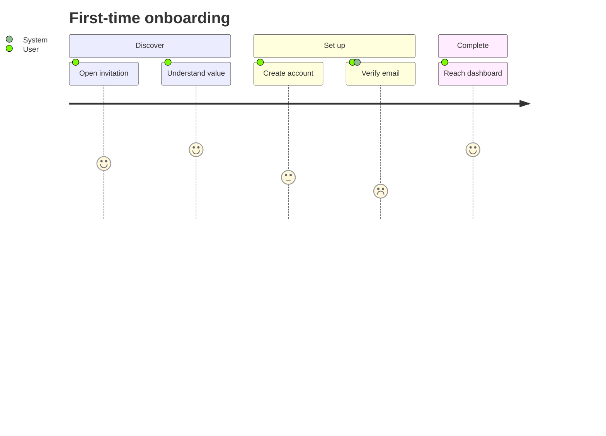

# Mermaid Documentation Patterns

Adapt these patterns to the current system. Keep only the nodes, messages, fields, and transitions that answer the reader's question.

## Flowchart — pages, paths, and decisions

Use decision labels for meaningful branches. Do not model widget internals or every loading state.

## Sequence diagram — interactions and failures

Use `alt`, `opt`, or `loop` only when they change the contract. Name participants by system responsibility, not client-library classes.

## State diagram — lifecycle

Use states that are visible to the domain or important to recovery. Do not use this diagram for a linear happy path.

## Class diagram — conceptual domain model

Show domain concepts, cardinalities, and only the fields or operations needed to clarify the relationship. Avoid mirroring every implementation class.

## ER diagram — persistence model

Use this for durable storage semantics. Mark keys only when that aids understanding; do not reproduce every column or migration detail.

## Architecture — boundaries and integrations

Prefer this portable boundary view when C4 rendering is uncertain. For C4-capable renderers, use `C4Context` or `C4Container` only for stable, cross-cutting architecture—not for a narrow use-case flow.

## User journey — experience across steps

Use journey scores sparingly and only when they express an agreed product assessment, not an invented measurement.
