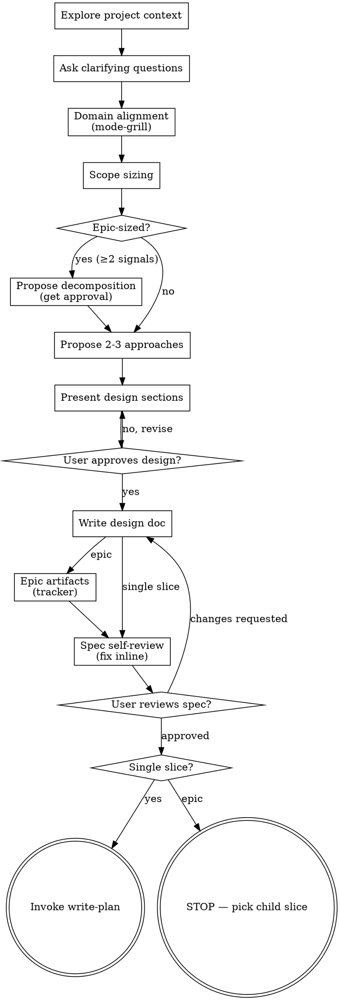

# Brainstorming Ideas Into Designs

Help turn ideas into fully formed designs and specs through natural collaborative dialogue.

**Step 0:** Invoke [workflow-config](../workflow-config/SKILL.md) and load `skills.config.json`.

Start by understanding the current project context, then ask questions one at a time to refine the idea. Once you understand what you're building, present the design and get user approval.

<HARD-GATE>
Do NOT invoke any implementation skill, write any code, scaffold any project, or take any implementation action until you have presented a design and the user has approved it. This applies to EVERY project regardless of perceived simplicity.
</HARD-GATE>

## Anti-Pattern: "This Is Too Simple To Need A Design"

Every project goes through this process. A todo list, a single-function utility, a config change — all of them. "Simple" projects are where unexamined assumptions cause the most wasted work. The design can be short (a few sentences for truly simple projects), but you MUST present it and get approval.

## Checklist

You MUST create a task for each of these items and complete them in order:

1. **Explore project context** — check files, docs, recent commits
2. **Ask clarifying questions** — one at a time, understand purpose/constraints/success criteria
3. **Domain alignment** — invoke `/mode-grill` to stress-test terminology and validate the plan against the existing domain model before proposing approaches
4. **Scope sizing** — apply decomposition heuristics ([REFERENCE.md](REFERENCE.md)); if epic-sized, propose slice table and get user approval before detailed design
5. **Propose 2-3 approaches** — with trade-offs and your recommendation
6. **Present design** — in sections scaled to their complexity, get user approval after each section
7. **Write design doc** — invoke the `write-feature-spec` skill, save to `{docs.root}/<domain>/<feature>/01-spec.md` and commit
8. **Epic artifacts** — if epic-sized and `taskTracker.enabled`: create child cards (with approval), update parent card description
9. **Spec self-review** — quick inline check for placeholders, contradictions, ambiguity, scope (see below)
10. **User reviews written spec** — ask user to review the spec file before proceeding
11. **Transition to implementation** — single slice → `write-plan` | epic → **STOP** and ask which child slice to implement first

## Process Flow

**Terminal states:**

| Scope        | Next skill                     | Notes                                                                                   |
| ------------ | ------------------------------ | --------------------------------------------------------------------------------------- |
| Single slice | `write-plan` (path A)          | Parent `{cardKey}` branch implements the full spec; ends with `write-finalize-docs` |
| Epic         | **STOP** — no `write-plan` yet | User picks a child `{cardKey}`; then `task-workflow` → `write-plan` → `write-finalize-docs` |

Do NOT write implementation code yourself. `write-plan` handles planning, user confirmation, and phased implementation.

## The Process

**Understanding the idea:**

- Check out the current project state first (files, docs, recent commits)
- Before asking detailed questions, assess scope: if the request describes multiple independent subsystems (e.g., "build a platform with chat, file storage, billing, and analytics"), flag this immediately. Don't spend questions refining details of a project that needs to be decomposed first.
- For appropriately-scoped projects, ask questions one at a time to refine the idea
- Prefer multiple choice questions when possible, but open-ended is fine too
- Only one question per message - if a topic needs more exploration, break it into multiple questions
- Focus on understanding: purpose, constraints, success criteria

**Scope sizing (Step 4):**

- Apply heuristics from [REFERENCE.md](REFERENCE.md#when-to-decompose) after domain alignment, before investing in full detailed design
- If epic-sized: present the decomposition table, get user approval on slices, then continue with **epic-level** design (boundaries between slices, shared decisions, order). Do not deep-design every slice upfront — detail the first slice only if the user already chose it
- If single-slice: proceed normally

**Exploring approaches:**

- Propose 2-3 different approaches with trade-offs
- Present options conversationally with your recommendation and reasoning
- Lead with your recommended option and explain why

**Presenting the design:**

- Once you believe you understand what you're building, present the design
- Scale each section to its complexity: a few sentences if straightforward, up to 200-300 words if nuanced
- Ask after each section whether it looks right so far
- Cover: architecture, components, data flow, error handling, testing
- Be ready to go back and clarify if something doesn't make sense

**Design for isolation and clarity:**

- Break the system into smaller units that each have one clear purpose, communicate through well-defined interfaces, and can be understood and tested independently
- For each unit, you should be able to answer: what does it do, how do you use it, and what does it depend on?
- Can someone understand what a unit does without reading its internals? Can you change the internals without breaking consumers? If not, the boundaries need work.
- Smaller, well-bounded units are also easier for you to work with - you reason better about code you can hold in context at once, and your edits are more reliable when files are focused. When a file grows large, that's often a signal that it's doing too much.

**Working in existing codebases:**

- Explore the current structure before proposing changes. Follow existing patterns.
- Where existing code has problems that affect the work (e.g., a file that's grown too large, unclear boundaries, tangled responsibilities), include targeted improvements as part of the design - the way a good developer improves code they're working in.
- Don't propose unrelated refactoring. Stay focused on what serves the current goal.

## After the Design

**Documentation:**

- **MANDATORY:** Invoke the `write-feature-spec` skill to author the spec. The spec MUST strictly follow that skill — do not write the spec freehand or invent a different structure.
- Write the validated design (spec) to `{docs.root}/<domain>/<feature>/01-spec.md`
  - (User preferences for spec location override this default)
- Use elements-of-style:writing-clearly-and-concisely skill if available
- Commit the design document to git

**Epic artifacts (Step 8 — epic-sized only):**

- After user approval, create child cards via [task-workflow](../task-workflow/SKILL.md) when provider is `trello`
- Update parent card description with child links and implementation order
- Search each new card via MCP to confirm real `{cardKey}` and `url` values — never invent card numbers
- Create `04-tasks.md` in the feature folder — slice decomposition aligned with child cards (order, depends on, out of scope per slice)

**Spec Document Structure:**

The spec MUST be authored through the [write-feature-spec](../write-feature-spec/SKILL.md) skill — it is the single source of truth for spec structure. Follow it strictly; do not invent a different structure here.

Reminders that the design flow enforces on top of the template:

- **No code snippets** — no TypeScript, JSX, JSON, file paths, or component names in `01-spec.md`. Architecture belongs in `02-context.md`, implementation belongs in `03-plan.md`.
- **Acceptance criteria must be testable**, and business rules must stay separate from acceptance criteria.
- **Scope and Out of scope are both explicit.**
- **Epic specs** cover the full feature vision; per-slice acceptance criteria live on child tracker cards

**Spec Self-Review:**
After writing the spec document, look at it with fresh eyes:

1. **Placeholder scan:** Any "TBD", "TODO", incomplete sections, or vague requirements? Fix them.
2. **Internal consistency:** Do any sections contradict each other? Does the architecture match the feature descriptions?
3. **Scope check:** Is this focused enough for a single implementation plan, or does it need decomposition? (If epic, confirm tracker children align with spec sections and parent card links are complete.)
4. **Ambiguity check:** Could any requirement be interpreted two different ways? If so, pick one and make it explicit.
5. **Template compliance:** Does the spec follow [write-feature-spec](../write-feature-spec/SKILL.md)? Acceptance criteria testable? Scope and out of scope explicit? No code snippets in `01-spec.md`?

Fix any issues inline. No need to re-review — just fix and move on.

This review can run inline (the default) or be delegated to a subagent for large or critical specs.

**User Review Gate:**
After the spec review loop passes, ask the user to review the written spec before proceeding:

> "Spec written and committed to `<path>`. Please review it and let me know if you want to make any changes before we start writing out the implementation plan."

For epics, add:

> "Child cards are on the task tracker (linked from the parent epic). Which slice should we implement first?"

Wait for the user's response. If they request changes, make them and re-run the spec review loop. Only proceed once the user approves.

**Implementation:**

- **Single slice:** Invoke the `write-plan` skill with the approved spec as input (path A). `write-plan` saves transient `03-plan.md`, updates `02-context.md`, implements phase by phase, then **must** invoke `write-finalize-docs` so the folder ends with only `01-spec.md` and `02-context.md`.
- **Epic:** Do **not** invoke `write-plan` for the full epic. Ask which child `{cardKey}` to implement, run `task-workflow` for that card, then `write-plan` scoped to that slice only (ends with `write-finalize-docs` per slice folder).

## Key Principles

- **One question at a time** - Don't overwhelm with multiple questions
- **Multiple choice preferred** - Easier to answer than open-ended when possible
- **YAGNI ruthlessly** - Remove unnecessary features from all designs
- **Explore alternatives** - Always propose 2-3 approaches before settling
- **Incremental validation** - Present design, get approval before moving on
- **Be flexible** - Go back and clarify when something doesn't make sense
- **Right-size delivery** - One card/branch/PR per reviewable slice; epics coordinate, they don't absorb all implementation
