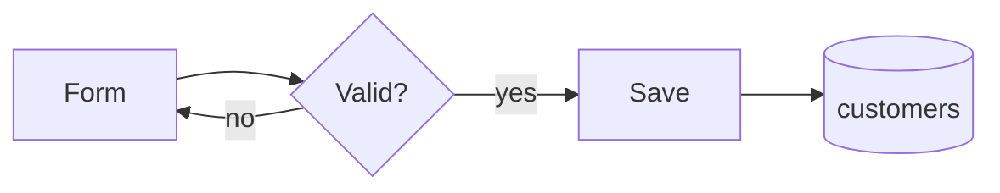

# Write Flows

Describe the flows that exist in the code as small diagrams with few words,
then point to where each flow starts. Inspect the code before drawing. Never
draw undecided behavior.

## Paths

Paths are fixed. Edit this file to change them. Tags (`<domain>`,
`<use-case>`, ...): see [write-spec — Scope](../write-spec/SKILL.md#scope).

| Scope               | File                                                    |
| ------------------- | ------------------------------------------------------- |
| Use case            | `.docs/<domain>/<use-case>/<use-case>.flows.md`         |
| Capability          | `.docs/capabilities/<capability>/<capability>.flows.md` |
| Codebase initiative | `.docs/codebase/<initiative>/<initiative>.flows.md`     |
| System boundaries   | `.docs/architecture/architecture.md`                    |

## Template

````md
# [Use case or capability]

[Spec](<use-case>.spec.md)

## [Flow name]



## [Other flow name]

```mermaid
...
```

## Entry points

- Screen: `apps/web/src/customers/CreateCustomerPage.tsx`
- API: `apps/api/src/customers/create-customer.handler.ts`
- Core rule: `apps/api/src/customers/create-customer.service.ts`
- Test: `apps/api/test/customers/create-customer.test.ts`

## Decisions

- ABC-12: the tax ID check lives in the service, not the form. The import job
  creates customers without passing through the form.
````

## Diagrams

- One diagram per flow. One diagram answers one question.
- Labels have 1–3 words. Name responsibilities, not classes or files.
- Size limits:
  - `flowchart`, `stateDiagram-v2`: 8 nodes or states
  - `sequenceDiagram`: 5 participants, 10 messages
  - `erDiagram`: 6 entities, key fields only
- At most one error or alternate branch per diagram.
- Over a limit: split into two flows. Never shrink labels to fit.
- Show failure, retry, async, and persistence paths only when they change
  behavior.
- No prose around diagrams unless one sentence removes a real doubt.
- No secrets, credentials, personal data, or payloads.
- Link the canonical diagram in `architecture.md`. Do not copy it.

| Question                           | Mermaid type                                        |
| ---------------------------------- | --------------------------------------------------- |
| Path, decision, or navigation?     | `flowchart`                                         |
| Who calls whom, in what order?     | `sequenceDiagram`                                   |
| Which lifecycle states exist?      | `stateDiagram-v2`                                   |
| How is data persisted and related? | `erDiagram`                                         |
| Which systems participate?         | `flowchart` (or `C4Container` in `architecture.md`) |

Patterns: [references/diagram-patterns.md](references/diagram-patterns.md).

## Entry points

The files where someone starts reading or changing the feature: where each flow
begins in code.

- 3–6 items. Not every touched file.
- Include where flows start (screen, route, handler, command, job, consumer),
  the core rule, and the main test.
- Short label plus path. No explanation.
- Verify every path exists each time the file is updated. Remove dead paths.

## Decisions

Comes after the entry points. Keeps the reason behind a non-obvious technical
decision in this use case: the kind a reader would undo without knowing it was
a decision. Why a guard lives in one place and not another, why an alternative
was rejected, a constraint imposed by an external contract.

- One bullet per decision. State the decision, then the reason.
- When the project tracks work by ticket, start the bullet with the ticket key.
- Not what the code already says.
- Not product rules. Those belong in the spec or in `<domain>.rules.md`.
- Not project architecture. That belongs in `architecture/`.
- Current decisions only. Delete a bullet when it stops being true. History
  lives in `changelog.md`.

## Update

When code changes, update the affected diagram and entry points. Delete
diagrams for flows that no longer exist. Keep the file in sync with the code,
not with history.
